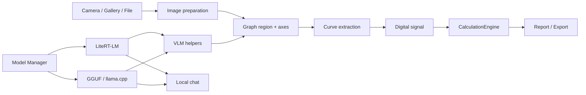

<h1 align="center">ChromaLab</h1>

<p align="center">
  <b>Offline-first лабораторная рабочая среда для анализа хроматограмм и локальных AI-моделей</b>
</p>

<p align="center">
  <a href="https://github.com/RandoTeam/ChromaLab/releases">
    
  </a>
  
  
  
</p>

---

ChromaLab начинался как мобильное приложение для оцифровки и расчета хроматограмм. Сейчас проект развивается в более широкую офлайн-среду: лабораторный расчетный контур, общий менеджер локальных моделей, VLM/LLM-чат и модульная база для будущих анализаторов.

> ChromaLab является вспомогательным аналитическим инструментом. Результаты должны проверяться квалифицированным специалистом перед научным, промышленным, медицинским или юридически значимым использованием.

## Что Уже Есть

| Контур | Статус | Описание |
|---|---:|---|
| Захват хроматограммы | Alpha | Камера через ML Kit Document Scanner, галерея, desktop file bridge |
| Оцифровка графика | Alpha | Поиск области графика, осей, кривой, OCR/VLM-подсказки, fallback-логика |
| Расчет пиков | Alpha 2 | Baseline, noise, peak detection, boundaries, integration, S/N, area %, resolution |
| Отчеты | Alpha | Таблицы пиков и параметры расчета уже выводятся, профессиональная интерпретация еще расширяется |
| Менеджер моделей | Alpha 2 | LiteRT-LM, GGUF, Hugging Face search, download/import/export/delete, роли моделей |
| Локальный чат | MVP | Чаты, история, Gallery-style UI, выбор модели из общего пула, runtime controls, streaming UI, lazy loading |
| Интерфейс | Alpha 2 | Настройка темы system/light/dark и портретный режим Android до отдельной landscape-проработки |

## Alpha 2

### Хроматография

- Обработка входа из камеры, галереи и файлового bridge.
- Расчетное ядро учитывает реальные параметры интеграции, а не только отображает их в UI:
  - boundary method;
  - clamp negative;
  - max width;
  - integration mode.
- Peak metrics: apex RT, centroid, height, area, width, prominence, S/N, confidence, overlap, tailing/asymmetry, resolution, area percent.
- В отчет добавлены параметры расчета, влияющие на результат.

### Локальные Модели

- Единый раздел моделей для научного контура и чата.
- Поддержка `.litertlm` через Google LiteRT-LM.
- Поддержка `.gguf` через llama.cpp bridge.
- Hugging Face поиск по моделям с сортировкой и compatibility metadata.
- Локальный import/export остается частью основного model manager.
- Модели не загружаются в память из менеджера моделей: чат и анализ хроматограмм загружают runtime только в момент работы.
- Отдельный выбор модели для хроматограмм сохраняется независимо от модели чата.

### Чат

- Отдельный раздел чатов.
- Несколько chat sessions.
- Настройки на уровне чата: system prompt, temperature, top-p, top-k, max tokens, repeat penalty, repeat last N.
- Gallery-style верхняя панель: название чата, model chip, отдельный model picker.
- Выбор модели из общего downloaded model pool без загрузки модели из менеджера.
- Capability-gated runtime controls: backend/accelerator выбираются только там, где это реально поддержано.
- Thinking toggle показывается только для моделей/runtime, которые могут вернуть thinking отдельно.
- Streaming-ответы с плавным буферизованным появлением текста и stop state во время генерации.
- Статистика под ответом: модель, backend, accelerator, prompt tokens, answer tokens, время, скорость генерации.
- Composer пока text-only: image/file context для чата отложен до полноценной поддержки storage, capability gating и runtime routing.
- При выходе из чата модель выгружается по lifecycle-таймеру, а перед анализом хроматограмм освобождается память.

## Pipeline



## Архитектура

| Модуль | Назначение |
|---|---|
| `composeApp/src/commonMain/kotlin/com/chromalab/feature/capture` | Захват и импорт входных данных |
| `composeApp/src/commonMain/kotlin/com/chromalab/feature/processing` | Image processing, OCR/VLM, signal extraction |
| `composeApp/src/commonMain/kotlin/com/chromalab/feature/calculation` | Детерминированные расчеты хроматограмм |
| `composeApp/src/commonMain/kotlin/com/chromalab/feature/settings` | Менеджер моделей и настройки |
| `composeApp/src/commonMain/kotlin/com/chromalab/feature/chat` | Локальный LLM-чат |
| `androidApp/src/main/cpp` | Native llama.cpp bridge для GGUF |

## Технологии

| Компонент | Технология |
|---|---|
| Язык | Kotlin Multiplatform |
| UI | Compose Multiplatform / Jetpack Compose Material 3 |
| Android capture | ML Kit Document Scanner |
| OCR | ML Kit Text Recognition |
| Local LLM/VLM | LiteRT-LM, llama.cpp |
| Data | Room, bundled SQLite, Kotlin serialization |
| Native | Android NDK, CMake |

## Сборка

Требования:

- JDK 17
- Android SDK 35
- Android NDK `27.2.12479018`
- CMake `3.22.1`

Команды:

```bash
./gradlew :composeApp:compileAndroidMain :composeApp:compileKotlinDesktop --no-daemon
./gradlew :androidApp:assembleDebug --no-daemon
./gradlew :androidApp:installDebug --no-daemon
```

Debug APK:

```text
androidApp/build/outputs/apk/debug/androidApp-debug.apk
```

## Roadmap

| Этап | Цель |
|---|---|
| Alpha 2 | Стабилизировать calculation engine, общий model manager, MVP чата, lifecycle моделей |
| Alpha 3 | Профессиональный отчет, лучшее объяснение расчетов, больше real-world validation |
| MVP | Полный цикл: capture/import -> digitization -> calculation -> report -> local AI explanation |
| Next | Chat attachments, real-world report validation, landscape UI only after dedicated design and QA |

## Ограничения Alpha

- CSV/TXT/PDF/mzML import еще не является production-grade парсером.
- GGUF image analysis требует подходящий `mmproj`; text-only GGUF модели используются для чата и текстовых задач.
- Токены в чате пока считаются локальной оценкой, пока runtime не отдаёт точные tokenizer metrics.
- Большая валидация на наборе реальных хроматограмм еще впереди.

## Лицензия

Proprietary. Copyright 2026.
