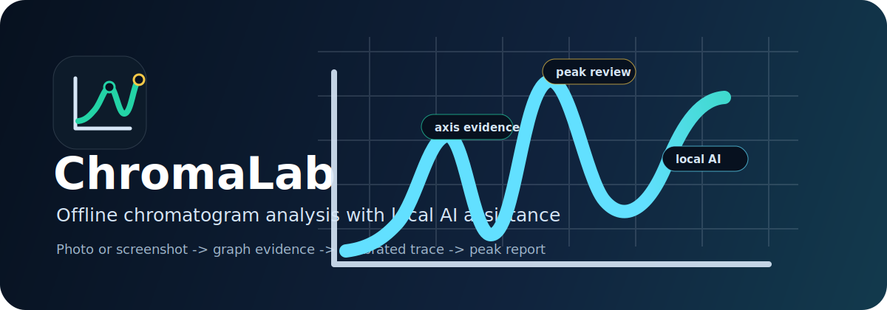
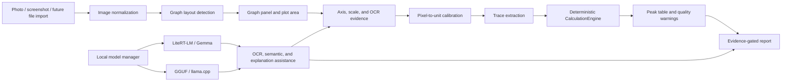

<h1 align="center">ChromaLab</h1>

<p align="center">
  <b>Offline-first chromatogram analysis, local AI assistance, and evidence-gated scientific reporting for Android and desktop research workflows.</b>
</p>

<p align="center">
  <a href="https://github.com/RandoTeam/ChromaLab/releases">
    
  </a>
  
  
  
  
</p>

<p align="center">
  
</p>

---

ChromaLab is a scientific mobile and desktop project for turning chromatogram photos, screenshots, and future digital imports into auditable analysis results. The product goal is simple for the user: take a photo or select an image, then let the app detect the graph, calibrate the axes, extract the trace, detect peaks, validate the evidence, and generate a professional report.

The engineering principle is stricter: chromatographic numbers must come from deterministic, inspectable algorithms. Local AI can help with OCR, graph understanding, semantic warnings, explanations, and report language, but it must not invent retention times, peak areas, calibration coefficients, compound identities, or other scientific measurements.

> ChromaLab is an analytical research and education tool under active validation. It is not a certified medical, forensic, regulatory, or industrial decision system. Scientific or legally significant use requires expert review and independent validation.

## Why ChromaLab Exists

Chromatograms are central to analytical chemistry, but many students, laboratories, and field users still work with screenshots, printouts, exported images, or photos of instrument software. Converting those visuals into useful calculations is difficult:

- the graph may be cropped, rotated, compressed, or photographed at an angle;
- axes and tick labels may be small, blurred, or partially missing;
- multiple ion traces can share one plot or appear as several panels;
- peak boundaries, baselines, and integrations must be explainable;
- AI can read text and assist interpretation, but it cannot be trusted as a numeric authority.

ChromaLab approaches this as an evidence problem. Every serious stage should expose what it saw, what it accepted, what it rejected, and why the final report is release-ready, review-only, diagnostic-only, or blocked.

## What The App Does

| Area | Current capability | Status |
|---|---|---:|
| Capture and import | Android camera/gallery flow, ML Kit document scanner, desktop development bridge | Alpha |
| Graph detection | Graph panel, plot area, layout classification, multi-panel handling research, Android fixture validation | Research alpha |
| Axis and scale resolution | Deterministic tick/grid/label evidence, calibration strategies, regression shields | Research alpha |
| Trace extraction | Pixel-to-signal extraction and overlay evidence for supported fixtures | Alpha |
| Peak calculation | Deterministic `CalculationEngine` with baseline, noise, peak boundaries, integration, S/N, area percent, FWHM, resolution, and warnings | Alpha |
| Reports | Report contract JSON, Markdown/HTML exports, evidence gates, validator output | Alpha |
| Local AI models | LiteRT-LM, GGUF, llama.cpp bridge, model manager, Hugging Face search/import workflows | Beta |
| Local chat | Multi-session local chat, model picker, runtime controls, streaming, GGUF MTP text acceleration | Beta |
| Rust CV core | Rust axis/geometry prototype and Android bridge experiments | In progress |

## Autonomous Analysis Pipeline



AI assists the pipeline. It does not replace the deterministic calculation path.

## Scientific Calculation Core

The calculation layer receives a calibrated `DigitalSignal(time, intensity)` and returns an immutable calculation run. The current deterministic pipeline includes:

1. input signal validation;
2. optional smoothing;
3. baseline estimation;
4. baseline correction;
5. noise estimation;
6. peak detection;
7. peak boundary detection;
8. overlap classification;
9. peak integration;
10. peak metrics and confidence;
11. run warnings;
12. report/export parameters.

Supported calculation concepts include:

- boundary methods such as prominence bases, local minima, baseline intersection, and percent-height boundaries;
- trapezoidal and interpolated trapezoidal integration;
- optional negative-area clamping;
- peak metrics including apex retention time, centroid, height, area, width, prominence, S/N, confidence, overlap, tailing/asymmetry, resolution, and area percent.

The calculation engine is intentionally separated from the vision and AI stages so that model behavior cannot silently change chromatographic math.

## Local AI Runtime

ChromaLab is designed around local, privacy-preserving AI:

- LiteRT-LM is the Android reference path for compatible local Gemma-style models.
- Gemma E2B is treated as the baseline FAST/weaker-device mode where supported.
- Larger/full-analysis models can be used when device memory and acceleration allow.
- GGUF models run through a native llama.cpp bridge for local chat and compatible text tasks.
- GGUF MTP speculative decoding is scoped to text-only chat until strict chromatogram-analysis quality gates validate it.
- OCR/document-only models remain specialized tools unless they satisfy the chromatogram vision contract.

Model safety rules:

- AI may improve local crop OCR, title/ion classification, warning explanations, Knowledge Pack explanations, and overlay review comments.
- AI may be advisory for graph quality, plot-area warnings, axis visibility warnings, and multi-graph suspicion.
- AI must not erase deterministic graph candidates.
- AI must not create pixel coordinates, calibration coefficients, RT, height, area, FWHM, S/N, baseline, Kovats index, or compound identification without explicit evidence.

## Evidence Gates

ChromaLab reports are gated by evidence, not appearance.

| Gate | Meaning |
|---|---|
| `RELEASE_READY` | Required evidence is complete and no critical blocker remains. |
| `REVIEW_ONLY` | The app produced useful analysis, but a human should review evidence before relying on it. |
| `DIAGNOSTIC_ONLY` | The run is useful for debugging or learning, but not for scientific reporting. |
| `BLOCKED` | A critical stage failed, such as graph detection, calibration, trace extraction, export, or validator evidence. |

Current public truth audit status: Phase 9 is not accepted as a production autonomous pipeline. Recent fixture validation shows several review-grade successes and remaining blocked cases, especially around difficult axis calibration and multi-panel graph layout semantics. This is documented rather than hidden.

Start with:

- [Phase 9J Autonomous Analysis Truth Audit](docs/PHASE9J_AUTONOMOUS_ANALYSIS_TRUTH_AUDIT.md)
- [Phase 9J Product Acceptance Table](docs/PHASE9J_PRODUCT_ACCEPTANCE_TABLE.md)
- [Phase 9J Scientific Acceptance Table](docs/PHASE9J_SCIENTIFIC_ACCEPTANCE_TABLE.md)
- [Phase 9J E2B Acceptance Matrix](docs/PHASE9J_E2B_ACCEPTANCE_MATRIX.md)
- [Engineering Next Fixes](docs/PHASE9J_ENGINEERING_NEXT_FIXES.md)

## Technology Stack

| Layer | Technologies |
|---|---|
| Shared app code | Kotlin Multiplatform |
| UI | Compose Multiplatform, Jetpack Compose, Material 3 |
| Android capture | Camera/gallery flow, ML Kit Document Scanner |
| OCR | ML Kit Text Recognition, local crop OCR workflows |
| Calculation | Deterministic Kotlin `CalculationEngine` |
| Computer vision | Kotlin CV pipeline, Rust CV core in progress, OpenCV bindings where applicable |
| Local AI | LiteRT-LM, Gemma-compatible local models, GGUF, llama.cpp |
| Storage | Room, bundled SQLite, Kotlin serialization |
| Dependency injection | Koin |
| Native runtime | Android NDK, CMake, JNI bridge |
| Validation | Android fixture runs, desktop benchmarks, runtime evidence packages, validator JSON/Markdown |
| Research tooling | Python/Rust/Kotlin benchmark scripts and artifact generators |

## Repository Map

| Path | Purpose |
|---|---|
| `composeApp/` | Kotlin Multiplatform app code, shared UI, processing, calculation, reporting, model management, and chat features. |
| `androidApp/` | Android application wrapper, native runtime bridge, APK build targets, Android-specific model/runtime integration. |
| `rust/chromalab-cv-core/` | Rust computer-vision core experiments and bridge work for faster graph/axis analysis. |
| `docs/` | Product, scientific, validation, architecture, model, research, and phase documentation. |
| `artifacts/` | Local validation artifacts, screenshots, benchmark outputs, and truth-audit evidence. Not all artifacts are intended for release packaging. |
| `tools/` | Utility scripts for validation, benchmarking, and repository workflows. |
| `benchmark/` | Benchmark scaffolding and supporting data where present. |

## Validation Snapshot

The current validation story is intentionally transparent:

- Supported fixtures can reach graph detection, inferred calibration, trace extraction, peak calculation, report export, and validator output.
- Some difficult real-world fixtures remain blocked or review-only because graph layout, axis scale resolution, or calibration evidence is not strong enough.
- E2B model-enabled mode is tested against deterministic baseline behavior and must not degrade graph count, calibration, trace, peak metrics, or report gates.
- The project keeps blocked cases visible through artifact packages, validator reports, overlays, and next-fix documents.

Useful validation documents:

- [Autonomous Analysis Evidence Gates](docs/AUTONOMOUS_ANALYSIS_EVIDENCE_GATES.md)
- [Chromatogram Failure Taxonomy](docs/CHROMATOGRAM_FAILURE_TAXONOMY.md)
- [Chromatogram Regression Dataset](docs/CHROMATOGRAM_REGRESSION_DATASET.md)
- [Chromatogram Regression Matrix](docs/CHROMATOGRAM_REGRESSION_MATRIX.md)
- [Ground Truth Corpus And Metrics](docs/DRB_GROUND_TRUTH_CORPUS_AND_METRICS.md)

## Why This Matters For Students And Science

ChromaLab is designed for people who need to learn, inspect, and explain chromatographic results, not only click a black-box button.

For students:

- shows how a visual graph becomes a calibrated signal;
- exposes peak metrics and calculation parameters;
- teaches why evidence quality matters;
- supports local experimentation without cloud dependence.

For researchers and educators:

- provides an auditable analysis path for screenshots and photos;
- separates deterministic measurements from AI assistance;
- makes uncertainty and blocked evidence visible;
- creates a foundation for reproducible teaching datasets and validation fixtures.

For developers:

- combines mobile UI, local AI, scientific calculation, computer vision, and Rust/Kotlin systems work in one serious applied project;
- keeps validation artifacts close to implementation;
- makes failures inspectable instead of hiding them behind polished output.

## Developer Quick Start

Requirements:

- JDK 17;
- Android SDK 35;
- Android NDK `27.2.12479018`;
- CMake `3.22.1`;
- a recent Android Studio or compatible Gradle environment.

Common validation commands:

```bash
./gradlew :composeApp:compileKotlinDesktop --no-daemon
./gradlew :composeApp:assembleAndroidMain --no-daemon
./gradlew :androidApp:assembleDebug --no-daemon
```

On Windows PowerShell:

```powershell
.\gradlew.bat :composeApp:compileKotlinDesktop --no-daemon
.\gradlew.bat :composeApp:assembleAndroidMain --no-daemon
.\gradlew.bat :androidApp:assembleDebug --no-daemon
```

Debug APK path after build:

```text
androidApp/build/outputs/apk/debug/androidApp-debug.apk
```

Validation APK path after validation build:

```text
androidApp/build/outputs/apk/validation/androidApp-validation.apk
```

## Documentation Entry Points

- [Documentation Index](docs/README.md)
- [Technical Pipeline](PIPELINE.md)
- [Roadmap](ROADMAP.md)
- [Report Specification](REPORT_SPEC.md)
- [Scientific Product Overview](docs/CHROMALAB_SCIENTIFIC_PRODUCT_OVERVIEW.md)
- [Architecture Overview](docs/CHROMALAB_ARCHITECTURE_OVERVIEW.md)
- [Validation Evidence Summary](docs/CHROMALAB_VALIDATION_SUMMARY.md)
- [Autonomous Production Architecture](docs/AUTONOMOUS_PRODUCTION_ARCHITECTURE.md)
- [Local AI Runtime](docs/CHROMALAB_LOCAL_AI_RUNTIME.md)
- [Report Experience Concept](docs/CHROMALAB_REPORT_EXPERIENCE_CONCEPT.md)
- [Gemma LiteRT-LM Model Strategy](docs/GEMMA_LITERTLM_MODEL_STRATEGY.md)
- [Visual Identity](docs/CHROMALAB_VISUAL_IDENTITY.md)
- [Public Messaging Guide](docs/CHROMALAB_PUBLIC_MESSAGING_GUIDE.md)
- [Public Repository Presentation Plan](docs/OPENAI_SUBSIDY_REPOSITORY_PRESENTATION_PLAN.md)

## Current Roadmap

Near-term priorities:

1. finish the public repository presentation work;
2. keep improving real Android fixture validation and truth-audit clarity;
3. strengthen graph layout and axis calibration robustness;
4. move Rust CV work from prototype parity toward production integration;
5. improve report language and reviewer-facing documentation;
6. keep E2B FAST mode safe as a supported weaker-device baseline;
7. prepare a cleaner contribution, privacy, and release policy once the public repository structure is stable.

## Responsible Use

ChromaLab is not a substitute for validated laboratory software, calibrated instruments, or qualified scientific judgment. It is a research and education platform for offline chromatogram analysis workflows. Reports should be treated according to their evidence gate, and blocked or review-only output must not be presented as final scientific proof.

## License And Contribution Status

No public open-source license is currently declared at the repository root. Until a license is added, treat this repository as publicly visible source code rather than freely reusable open-source software.

External contribution guidelines, security policy, privacy statement, and release-quality documentation are planned as part of the public repository presentation work.
