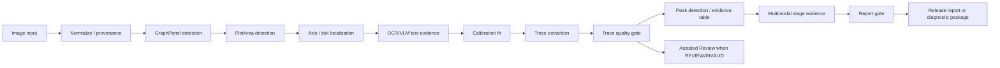

# Autonomous Production Architecture

## Product Target

`AUTONOMOUS_PRODUCTION` is the primary ChromaLab workflow. The application should analyze chromatogram images automatically and only ask for user review when a stage is low-confidence, invalid, or blocked.

## High-Level Flow

## Primary Rule

Automatic evidence is attempted first. Assisted and manual editors are repair tools, not the default production workflow.

## Numeric Authority

Deterministic geometry, calibration, trace extraction, and chromatographic calculations remain the numeric authority. VLM/OCR may supply text/semantic evidence and overlay judgments but cannot supply final numeric geometry or chromatographic metrics.

## Release-Ready Requirement

Automatic release requires:

- graphPanel `VALID`;
- plotArea `VALID`;
- X and Y calibration `VALID`;
- trace `VALID`;
- peak evidence `VALID`;
- evidence package `VALID`;
- source provenance `VALID`;
- validator has no blocking findings.

If any required gate is missing, invalid, or review-grade, the run becomes `AUTO_DIAGNOSTIC`, `REVIEW_ONLY`, `DIAGNOSTIC_ONLY`, or enters `ASSISTED_REVIEW`.

## Assisted Review Escalation

The app should ask for review only for the failed stage:

- uncertain ROI -> Phase 2 ROI editor;
- invalid/review calibration -> Phase 3 calibration editor;
- sparse/fragmented trace -> Phase 4 trace overlay review;
- weak/ambiguous peaks -> Phase 5 Assisted Peak Review fallback.

User intervention is never hidden. Reports must state which gates are automatic and which were user-confirmed or manual.

## Phase 5 Peak Layer

Autonomous peak detection remains the primary path. `CalculationRun` peaks are wrapped as `PeakEvidence` rows with apex, local-maximum, height, area, width/FWHM, S/N, boundary, overlap, artifact, and provenance fields. Manual peak review is not the default route; it is used only when autonomous peak evidence is review-grade or invalid.

## Phase 6 Multimodal Intelligence Layer

Phase 6 adds `AutonomousStageJudgeResult`, OCR/VLM crop results, model runtime profiles, and strict VLM JSON boundaries. These records explain why a stage passed, entered review, timed out, or requested a retry. They do not replace deterministic geometry, calibration, trace extraction, or peak integration.
# Phase 6C Knowledge Pack Integration

Date: 2026-05-20

AUTONOMOUS_PRODUCTION can use the local Knowledge Pack for semantic grounding only. The autonomous pipeline still owns measurement through deterministic image/geometry/calibration/trace/peak stages.

Knowledge Pack responsibilities:

- classify OCR text such as ion/channel titles versus peak annotations;
- explain warnings and caveats;
- provide terminology and synonym lookup;
- ground report language with cited entry IDs;
- preserve source/license provenance.

Knowledge Pack non-responsibilities:

- no numeric peak metrics;
- no calibration coefficients;
- no integration override;
- no compound identification without explicit evidence;
- no cloud lookup.

Assisted Review and Manual Advanced may use the same knowledge snippets to explain why a gate failed, but manual/user intervention remains visible in provenance.

## Phase 8 Regression Gate

Phase 8 adds the proof layer for autonomous production. A run is not considered production-ready merely because a report can be rendered. It must appear in the regression dataset, produce the required evidence package and validator artifacts, preserve per-graph gate status, pass report/export privacy checks, and classify any non-release terminal state using the failure taxonomy.

The current desktop regression layer proves contract, report, evidence, and fixture behavior. Real Android validation remains required before the autonomous path can be called fully closed for Phase 8.
