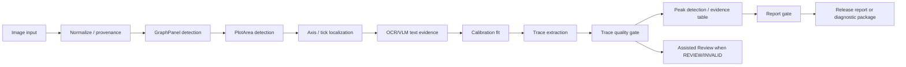

# Autonomous Production Architecture

## Product Target

`AUTONOMOUS_PRODUCTION` is the primary ChromaLab workflow. The application should analyze chromatogram images automatically and only ask for user review when a stage is low-confidence, invalid, or blocked.

## High-Level Flow

## Primary Rule

Automatic evidence is attempted first. Assisted and manual editors are repair tools, not the default production workflow.

## Numeric Authority

Deterministic geometry, calibration, trace extraction, and chromatographic calculations remain the numeric authority. VLM/OCR may supply text/semantic evidence and overlay judgments but cannot supply final numeric geometry or chromatographic metrics.

## Release-Ready Requirement

Automatic release requires:

- graphPanel `VALID`;
- plotArea `VALID`;
- X and Y calibration `VALID`;
- trace `VALID`;
- peak evidence `VALID`;
- evidence package `VALID`;
- source provenance `VALID`;
- validator has no blocking findings.

If any required gate is missing, invalid, or review-grade, the run becomes `AUTO_DIAGNOSTIC`, `REVIEW_ONLY`, `DIAGNOSTIC_ONLY`, or enters `ASSISTED_REVIEW`.

## Assisted Review Escalation

The app should ask for review only for the failed stage:

- uncertain ROI -> Phase 2 ROI editor;
- invalid/review calibration -> Phase 3 calibration editor;
- sparse/fragmented trace -> Phase 4 trace overlay review;
- weak/ambiguous peaks -> Phase 5 Assisted Peak Review fallback.

User intervention is never hidden. Reports must state which gates are automatic and which were user-confirmed or manual.

## Phase 5 Peak Layer

Autonomous peak detection remains the primary path. `CalculationRun` peaks are wrapped as `PeakEvidence` rows with apex, local-maximum, height, area, width/FWHM, S/N, boundary, overlap, artifact, and provenance fields. Manual peak review is not the default route; it is used only when autonomous peak evidence is review-grade or invalid.
