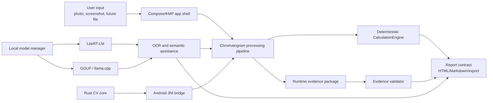
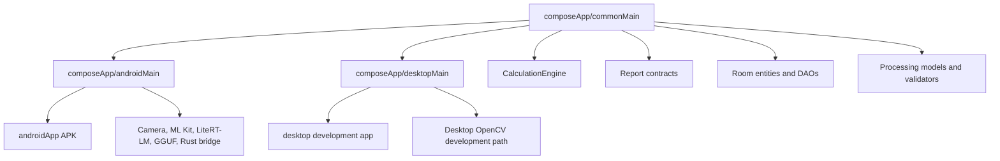
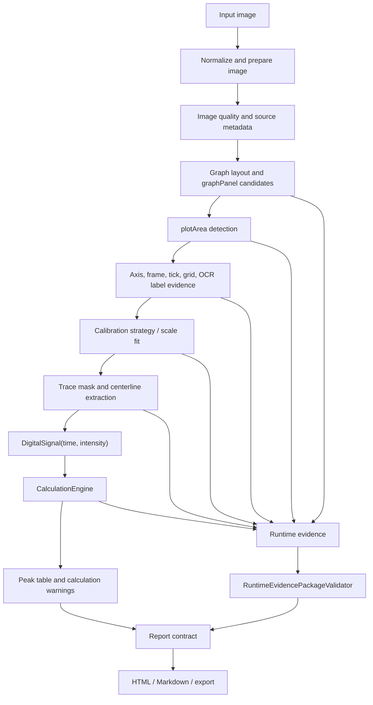
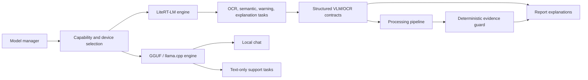
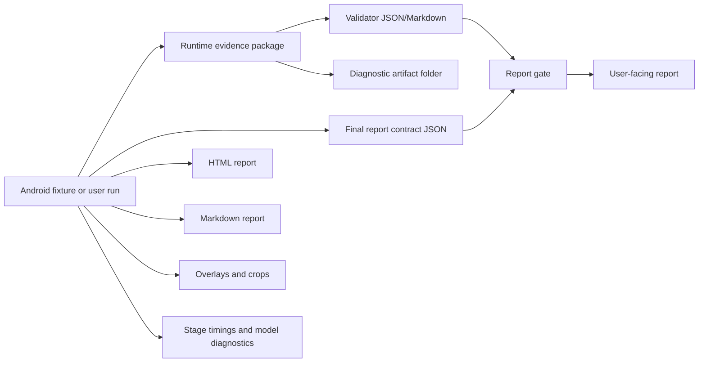

# ChromaLab Architecture Overview

Status: RP_4_ARCHITECTURE_OVERVIEW_READY

This document explains ChromaLab's current architecture for public reviewers, contributors, and scientific users. It focuses on how the Android/Kotlin Multiplatform app, deterministic chromatogram calculation, local AI runtime, Rust computer-vision work, evidence packages, and reports fit together.

ChromaLab is not structured as a single AI prompt or a single image-processing script. It is a layered application where numeric science, local AI assistance, user experience, validation, and artifact export have separate responsibilities.

## Architecture Principles

ChromaLab follows these architecture principles:

- Deterministic code owns chromatographic measurements.
- Local AI assists OCR, semantics, warnings, and explanations.
- Android and desktop development share as much Kotlin code as practical.
- Android-specific code handles camera, ML Kit, LiteRT-LM, native bridges, file export, and real-device validation.
- Rust CV work is introduced as a performance and robustness layer, not as a blind rewrite.
- Every serious analysis stage should produce evidence, timing, and failure reasons.
- A report gate must reflect evidence quality rather than visual polish.

## System At A Glance



## Gradle Module Map

| Module | Role | Key responsibilities |
|---|---|---|
| `composeApp` | Kotlin Multiplatform shared application module | Shared UI, feature screens, calculation engine, processing models, report contracts, model manager state, Room entities/DAOs, desktop target. |
| `androidApp` | Android application wrapper | Android app id, build variants, signing, native CMake bridge, Rust JNI library packaging, validation APK, launcher resources. |
| `rust/chromalab-cv-core` | Rust computer-vision core | Axis/geometry bridge prototypes, Android JNI bridge, JSON contracts, future high-performance CV routines. |

The root Gradle project includes only `:composeApp` and `:androidApp`. Rust is built through a separate Cargo workspace and copied into Android JNI libraries by the Android build task.

## Kotlin Multiplatform Layout



### `commonMain`

The shared source set contains the product and scientific core:

- `feature/calculation`: deterministic signal and peak calculation.
- `feature/processing`: graph, axis, calibration, OCR contracts, trace, geometry, pipeline, evidence packages, validators, and processing UI models.
- `feature/reports`: report contract, Markdown/HTML renderers, warnings, Knowledge Pack interpretation, report validation.
- `feature/knowledge`: local Knowledge Pack models, rules, retrieval, and Kovats-related support with strict evidence boundaries.
- `feature/settings`: model manager state and Hugging Face search metadata.
- `feature/chat`: local chat session models and UI.
- `core/data`: Room database, entities, DAOs, and shared persistence contracts.

### `androidMain`

The Android source set contains platform integrations:

- camera and manual capture screens;
- ML Kit document scanner and text OCR;
- LiteRT-LM engine;
- GGUF/llama.cpp diagnostics and runtime bridge wrappers;
- Rust CV bridge wrapper;
- Android file sharing and export support;
- Android validation fixture runner and artifact exporter;
- Android runtime evidence file probes and diagnostics.

### `desktopMain`

The desktop target supports development workflows and desktop validation. It uses Compose Desktop and OpenCV bindings where applicable. It is not currently presented as the primary end-user release surface.

## Feature Architecture

| Feature area | Main package path | Purpose |
|---|---|---|
| Capture | `feature/capture` | Camera/gallery input models and Android capture flow. |
| Processing | `feature/processing` | Image analysis, graph detection, axis/calibration evidence, trace extraction, OCR/VLM contracts, validation artifacts. |
| Calculation | `feature/calculation` | Deterministic chromatographic calculation from calibrated signal to peak metrics. |
| Reports | `feature/reports` | Report contract, report rendering, evidence gate surfacing, scientific warnings. |
| Knowledge | `feature/knowledge` | Local Knowledge Pack rules and retrieval for grounded explanations. |
| Settings/model manager | `feature/settings` | Local model catalog, imports, Hugging Face search metadata, model state. |
| Chat | `feature/chat` | Local LLM chat sessions and UI contracts. |
| Validation | `feature/validation` | Android validation fixture runner and artifact export flow. |
| Persistence | `core/data` | Room database, chromatogram/sample/project/calculation/peak/audit entities and DAOs. |

## Chromatogram Analysis Flow



The pipeline target is autonomous analysis, but each stage can still end in review, diagnostic, or blocked status if required evidence is missing.

## Deterministic Calculation Boundary

The `CalculationEngine` is the numeric authority for calibrated chromatographic signal processing.

It receives:

```text
DigitalSignal + CalculationParams
```

It returns:

```text
CalculationRun
```

The engine owns:

- smoothing configuration;
- baseline estimation and correction;
- noise estimation;
- peak detection;
- peak boundaries;
- overlap classification;
- integration;
- height, area, area percent, FWHM, S/N, resolution, and related peak metrics;
- warnings and confidence.

Image CV and local AI may help produce a calibrated signal. They must not directly create final chromatographic metrics.

## Local AI Runtime Architecture



LiteRT-LM is the Android reference path for compatible Gemma-style local models. E2B is treated as the baseline FAST/weaker-device model where supported. Larger models can be used when device memory and acceleration allow.

GGUF runs through the native llama.cpp bridge. Text-only GGUF chat can use MTP speculative decoding. Multimodal GGUF image analysis requires valid model pairing and must satisfy the same chromatogram-vision contract before it can be accepted for strict analysis.

## AI Safety Boundary

AI may:

- read local crop text;
- classify title, ion, channel, and label regions;
- explain warnings;
- summarize evidence;
- provide Knowledge Pack grounded scientific language;
- flag disagreement or uncertainty.

AI must not:

- erase deterministic graph candidates;
- provide final pixel geometry;
- provide calibration coefficients;
- create RT, height, area, FWHM, S/N, baseline, Kovats, or peak metrics;
- override deterministic peak calculations;
- claim compound identity without explicit evidence.

This boundary is enforced as a product architecture rule, not only as prompt wording.

## Native Runtime And Rust CV

ChromaLab currently has two native directions:

| Native component | Location | Role |
|---|---|---|
| llama.cpp bridge | `androidApp/src/main/cpp/llama_bridge.cpp` | Native GGUF inference bridge for Android. |
| Rust CV core | `rust/chromalab-cv-core` | Rust axis/geometry/CV prototype, Android JNI bridge, future performance layer. |

The Android build packages the Rust shared library by running `tools/rust/Build-RustAndroidBridge.ps1` and placing `libchromalab_cv_core.so` under generated JNI libs. The Android module also builds the llama.cpp bridge through CMake.

Rust is introduced to improve speed, reproducibility, and robustness for geometry-heavy CV stages. It is not meant to blindly port old logic. Rust routines must be validated against the same fixture corpus and evidence contracts before becoming production analysis authority.

## Validation Build Architecture

The Android app has a dedicated validation build type:

```text
com.chromalab.app.validation
```

Validation build behavior:

- inherits debug behavior;
- uses `applicationIdSuffix = ".validation"`;
- is debuggable;
- packages validation assets from `composeApp/src/androidMain/assets`;
- packages generated Rust JNI libraries;
- can run fixture validation side-by-side with the normal app package.

This is important because validation can run on a real device without uninstalling the user's normal app package or destroying app data.

## Evidence And Export Architecture



Evidence exports can include:

- original or normalized image references;
- graphPanel and plotArea overlays;
- axis/tick/calibration evidence;
- OCR crops;
- trace overlay;
- peak overlay and peak evidence table;
- model diagnostics;
- runtime timings;
- validator JSON/Markdown;
- final report contract JSON;
- HTML and Markdown report output;
- failure package when a graph-stage failure occurs.

User-facing reports and diagnostic artifacts should remain separated so debug-only evidence does not leak into normal user exports.

## Storage And Privacy Surfaces

The persistence layer uses Room and bundled SQLite through shared KMP data contracts.

Tracked domain concepts include:

- projects;
- samples;
- chromatograms;
- calculations;
- peaks;
- audit entries.

Privacy-sensitive surfaces include:

- user chromatogram images;
- normalized images;
- generated reports;
- evidence packages;
- model files;
- local logs;
- export/share paths;
- validation artifacts.

The architecture is offline-first, but offline-first is not the same as security-audited. Secure export review, storage policy, and privacy documentation remain explicit public roadmap items.

## Build And Release Surfaces

| Surface | Purpose |
|---|---|
| `:composeApp:compileKotlinDesktop` | Desktop/shared Kotlin compile validation. |
| `:composeApp:assembleAndroidMain` | Android shared module build validation. |
| `:androidApp:assembleDebug` | Local debug Android APK. |
| `:androidApp:assembleValidation` | Side-by-side Android validation APK. |
| `:androidApp:assembleRelease` | Signed release APK when local signing properties are configured. |

Current Android identity:

- package: `com.chromalab.app`;
- validation package: `com.chromalab.app.validation`;
- min SDK: 26;
- target SDK: 35;
- primary ABI: `arm64-v8a`;
- current declared version in Gradle: `0.0.5-beta.6`.

## Technology Versions

Important versions from the Gradle version catalog:

| Technology | Version |
|---|---:|
| Kotlin | 2.3.21 |
| Android Gradle Plugin | 9.2.1 |
| Compose Multiplatform | 1.10.3 |
| Room | 2.7.1 |
| CameraX | 1.5.2 |
| Lifecycle | 2.10.0 |
| Coroutines | 1.10.1 |
| Kotlin serialization | 1.7.3 |
| Koin | 4.0.2 |
| ML Kit Text Recognition | 16.0.1 |
| ML Kit Document Scanner | 16.0.0-beta1 |
| OpenPnP OpenCV | 4.9.0-0 |
| LiteRT-LM Android | 0.12.0 |

## Current Architecture Limits

Known limits that should remain visible:

- Phase 9 is not accepted as a production autonomous validation milestone.
- Some Android fixtures still require review or remain blocked.
- Graph layout and axis calibration are the main scientific runtime challenges.
- Rust CV is promising but still needs production integration and parity validation.
- Local AI boundaries must remain strict.
- The public documentation index still needs cleanup.
- The root repository still needs a license decision before using open-source licensing claims.

## Reviewer Takeaway

ChromaLab's architecture is built around a deliberate separation:

```text
local AI helps interpret evidence;
deterministic code calculates chromatographic numbers;
validators decide whether a report can be trusted.
```

That separation is the reason the project can be useful for students and researchers without pretending that a model-generated answer is scientific proof.
