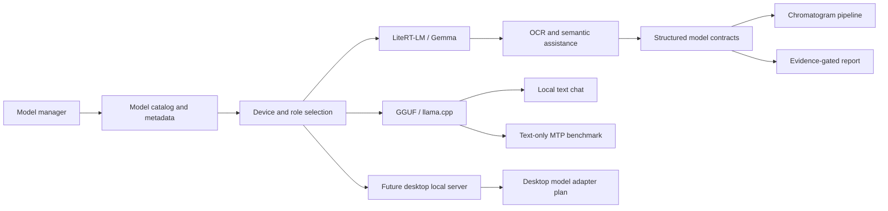

# ChromaLab Local AI Runtime

Status: RP_6_LOCAL_AI_RUNTIME_READY

This document explains ChromaLab's local AI runtime strategy for public reviewers, contributors, and scientific users. It describes what the models are for, how LiteRT-LM, Gemma, GGUF, llama.cpp, MTP, model diagnostics, and device selection fit into the product, and which scientific boundaries must never be crossed.

## Runtime Thesis

ChromaLab uses local AI to assist chromatogram analysis, not to replace deterministic scientific calculation.

The core rule is:

```text
Local AI may help read, classify, warn, explain, and review evidence.
Deterministic code must own graph geometry, calibration, trace, peak metrics, and report gates.
```

This separation is the reason local AI can be useful without becoming a black-box source of chromatographic truth.

## Why Local AI Matters

Local AI is important for ChromaLab because chromatogram images contain visual and text context that classical CV alone may not always interpret cleanly:

- small or blurred axis labels;
- ion/channel text;
- title and method labels;
- plot annotations;
- warning explanation;
- overlay review;
- user-facing report language;
- local Knowledge Pack grounded explanations.

At the same time, chromatographic metrics such as retention time, height, area, FWHM, S/N, baseline, calibration coefficients, and peak count must be measured or calculated, not guessed by a model.

## Runtime Layers



## Model Roles

ChromaLab separates models by role.

| Role | Purpose | Numeric authority? |
|---|---|---:|
| Chromatogram semantic assistant | OCR fallback, text-region classification, overlay/warning explanation | No |
| Local chat model | General local chat and developer/user assistance | No |
| Knowledge Pack explainer | Grounded scientific explanation using bounded local entries | No |
| OCR/document model | Specialized OCR/document extraction when a validated adapter exists | No |
| Deterministic calculation engine | Signal processing, peak detection, integration, metrics | Yes |

Models can support analysis only when their role and capability match the task. A text-only model is not accepted for chromatogram image analysis just because it can chat.

## LiteRT-LM Strategy

LiteRT-LM is the Android reference runtime for compatible Gemma-style local models.

Current public strategy:

- Gemma E2B LiteRT-LM is the FAST/weaker-device baseline where supported.
- Gemma E4B LiteRT-LM is the FULL_ANALYSIS candidate when installed and validated.
- Device-specific E2B bundles can be selected only when the Android device signals match the target bundle.
- Generic E2B remains the fallback FAST baseline when a matching device-specific bundle is not downloaded or not allowed.
- Model availability, selected model id, backend, load result, timing, timeout status, fallback reason, and path class should be recorded in technical evidence.

Important validation status:

- Phase 9 Android validation loaded and executed E2B in the validation package.
- E2B did not regress deterministic graph count, calibration, or metrics in the Phase 9J evidence slice.
- E4B was not installed in that validation package during Phase 9 and remains a follow-up validation item.

## Gemma Catalog

The current catalog direction includes:

| Model id | Target | Mode | Public role |
|---|---|---|---|
| `gemma4-e2b` | Generic Android | FAST | Weaker-device baseline and default fallback. |
| `gemma4-e2b-qualcomm-sm8750` | Qualcomm SM8750 / Snapdragon 8 Elite class | FAST | Device-specific E2B bundle, selected only on matching devices. |
| `gemma4-e2b-qualcomm-qcs8275` | Qualcomm QCS8275 / Dragonwing IQ8 | FAST | Device-specific E2B bundle, selected only on matching devices. |
| `gemma4-e2b-google-tensor-g5` | Google Tensor G5 | FAST | Device-specific E2B bundle, selected only on matching devices. |
| `gemma4-e4b` | Generic Android | FULL_ANALYSIS | Larger model candidate requiring separate validation. |

Large model files are not committed to the repository. They are discovered under app-private model storage and must pass download/import preflight checks.

## Device Selection

Device-aware selection is deterministic and metadata-driven.

Selection priorities:

1. Use a user-selected chromatogram model only if it is downloaded, compatible, and allowed on the current device target.
2. Use a matching device-specific E2B bundle when the device target matches and the model is downloaded.
3. Fall back to generic E2B when no matching device-specific E2B bundle is available.
4. Fall back to existing chromatogram priority ranking only when generic E2B is absent.
5. Reject nonmatching device-specific bundles for automatic pipeline use.

Detected targets currently include:

- Qualcomm SM8750 / Snapdragon 8 Elite class;
- Qualcomm QCS8275 / Dragonwing IQ8;
- Google Tensor G5;
- generic fallback when no exact signal is present.

Accelerator choice must be recorded as runtime evidence. Public documentation should not promise a specific GPU/NPU path unless that path is validated for the selected model bundle and device.

## Model Storage And Discovery

Validation and app packages use app-private storage:

```text
<app filesDir>/models/<model-id>/<model-file>
```

Validation package layout example:

```text
/data/user/0/com.chromalab.app.validation/files/models/<model-id>/<model-file>
```

Expected validation model examples:

```text
files/models/gemma4-e4b/gemma-4-E4B-it.litertlm
files/models/gemma4-e2b/gemma-4-E2B-it.litertlm
```

Do not store large model files in the Git repository. The repository should document expected local paths and validation commands rather than commit multi-gigabyte binaries.

## GGUF And llama.cpp Strategy

GGUF support exists through the Android native llama.cpp bridge.

Current role:

- text-only GGUF: local chat and text tasks;
- multimodal GGUF: image tasks only when the base GGUF and matching `mmproj` are present and validated;
- GGUF compatibility: benchmark and alternative runtime path, not the default strict chromatogram VLM path.

GGUF models must satisfy the same structured chromatogram contract before strict image analysis accepts them. A text-only GGUF model must not be silently used for chromatogram image analysis.

## MTP And Speculative Decoding

MTP/speculative decoding is treated as a runtime acceleration topic, not as a scientific method.

Current policy:

- GGUF MTP is scoped to text-only chat benchmarks.
- LiteRT-LM MTP/speculative capability is diagnostics-only unless future validation explicitly enables it.
- MTP is disallowed for GGUF `mmproj` vision analysis.
- MTP is disallowed for strict chromatogram numeric analysis.
- MTP must not change graph count, geometry, calibration, trace extraction, peak metrics, or report gates.

The GGUF MTP A/B benchmark can measure timing and first-token latency. Automatic enablement remains blocked unless native drafted/accepted token statistics and acceptance rate become structurally available and pass gate thresholds.

## Structured Runtime Diagnostics

Model behavior should be inspectable through technical evidence.

Structured runtime diagnostics can record:

- diagnostic id;
- runtime source;
- model id;
- model path class;
- backend;
- load attempted/result;
- load time;
- first response latency;
- total response duration;
- timeout budget/status;
- fallback reason;
- MTP/speculative capability fields;
- export privacy class.

Path privacy rule:

The evidence package stores model path class, not raw private paths. Examples:

- `APP_PRIVATE_MODEL`;
- `VALIDATION_PACKAGE_PRIVATE_MODEL`;
- `PUBLIC_DOWNLOAD_EXPORT`;
- `USER_SELECTED_EXTERNAL`;
- `NOT_AVAILABLE`;
- `UNKNOWN`.

Normal user report Markdown/HTML should not expose private Android or desktop model paths.

## Model Use In The Chromatogram Pipeline

Model-enabled validation should preserve this order:

```text
1. Run deterministic graphPanel, plotArea, tick/label, and calibration attempts.
2. Activate local model only after deterministic evidence exists where required.
3. Use model output for OCR/semantic/warning/report assistance.
4. Store model diagnostics and disagreement evidence.
5. Keep deterministic graph/calibration/trace/peak evidence as authority.
```

If the model is unavailable:

- record model availability diagnostics;
- continue deterministic graph and calibration attempts;
- do not claim model-assisted evidence;
- do not fabricate semantic explanations;
- do not convert deterministic success into a blocked result solely because the model is unavailable.

If the model disagrees:

- keep deterministic evidence;
- mark review where appropriate;
- store disagreement evidence;
- do not erase graph candidates;
- do not lower or raise report gates without deterministic evidence.

## Knowledge Pack Boundary

The local Knowledge Pack can support scientific explanations, but it must be bounded.

Allowed Knowledge Pack uses:

- explain chromatographic concepts;
- ground warning explanations;
- cite local entry ids;
- distinguish supported, review, rejected, or missing-evidence claims.

Forbidden Knowledge Pack uses:

- create measured RT, height, area, FWHM, S/N, baseline, Kovats, or calibration;
- create final compound identity without explicit evidence;
- replace missing reference standards;
- bypass report gates.

Model output that uses Knowledge Pack context should include used entry ids and unsupported claims. Missing or unsupported scientific claims should force review or rejection.

## Chat Runtime Boundary

ChromaLab's local chat shares the model pool but remains separate from strict chromatogram analysis.

Chat may support:

- text-only GGUF;
- compatible LiteRT text models;
- local model telemetry;
- per-chat generation settings;
- text-only MTP where benchmarked and gated.

Chat must not:

- load a model just because the model manager screen is open;
- reuse an arbitrary chat model for strict chromatogram image analysis;
- treat chat responses as report evidence;
- create numeric chromatographic results.

## Desktop Runtime Direction

Android remains the primary validated mobile runtime. Desktop model runtime is planned separately.

Desktop direction:

- local OpenAI-compatible server adapter first, such as LM Studio;
- managed desktop llama.cpp path later;
- desktop LiteRT remains experimental until there is a supported package and validation path;
- desktop models must pass the same role and structured-output checks before strict chromatogram use.

Desktop improvements must not weaken Android validation or deterministic report gates.

## Security And Privacy Surfaces

Local model runtime has security and privacy implications:

- downloaded model files can be large and must be validated;
- partial downloads must be cleaned up on failure;
- model paths must not leak into user reports;
- prompts and crops may contain user image context;
- evidence packages can contain diagnostic crop paths and model metadata;
- exported runtime diagnostics must separate technical evidence from user-facing reports.

Codex Security and future repository security docs should review:

- model download/import/delete flows;
- Android file handling;
- app-private storage;
- export/share paths;
- logs;
- native runtime surfaces;
- dependency and bridge risks.

## Current Validation Snapshot

| Area | Status |
|---|---|
| Generic E2B FAST baseline | Implemented and validated in Phase 9 model-enabled Android fixture runs. |
| E2B regression safety | No deterministic graph/calibration/metric regression observed in Phase 9J. |
| E4B FULL_ANALYSIS | Documented target; not installed in Phase 9 validation package. |
| Device-specific E2B catalog | Documented and gated by device matching. |
| LiteRT MTP/speculative | Diagnostics-only. |
| GGUF text-only MTP | Debug benchmark and gating only. |
| GGUF `mmproj` strict vision | Requires validated base + `mmproj` and chromatogram contract. |
| Runtime diagnostics export | Technical evidence path exists; user report privacy boundary documented. |

## Public Claims To Avoid

Do not claim:

- local models make the product production-ready;
- E2B fixes blocked chromatogram fixtures;
- E4B is validated on the current Android suite;
- GGUF multimodal analysis is automatically equivalent to LiteRT-LM;
- MTP accelerates strict chromatogram analysis;
- model output can identify compounds without explicit evidence;
- model output can create chromatographic numeric metrics.

## Reviewer Takeaway

ChromaLab's local AI runtime is designed for controlled assistance. The model can help read and explain evidence, but the app's scientific credibility comes from deterministic calculation, structured evidence packages, validator gates, and explicit model boundaries.
