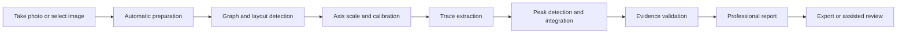

# ChromaLab Report Experience Concept

Status: RP_7_REPORT_EXPERIENCE_CONCEPT_READY

This document describes the target user-facing report experience for ChromaLab.
It is a product and design concept, not proof that the current app can already
render this complete interface.

The repository should not show fake screenshots, fake reports, or polished
mockups that imply the Android pipeline is production-ready. Until the runtime
analysis is stable across real fixtures, the right public artifact is a clear
report experience specification: what the final report should contain, how it
should look, what evidence it must expose, and which states must remain honest.

## Design Thesis

ChromaLab's final report should feel like a professional scientific result, not
like a debug log, terminal transcript, or AI chat response.

The report should answer four questions immediately:

1. What did the app analyze?
2. What did the app calculate?
3. How strong is the evidence?
4. What must the user review before trusting the result?

The report can be visually polished only if it remains scientifically honest.
Visual design must never hide missing calibration, weak trace extraction,
unsupported compound claims, blocked model stages, or review-only peak evidence.

## Honest Current Boundary

Current ChromaLab Android validation still has blocked fixture classes. The
public repository therefore should not present a screenshot gallery as if the
full autonomous product is already working.

Allowed now:

- target report structure;
- report information architecture;
- evidence and gate explanation;
- examples of report sections using placeholder labels such as `not calculated`
  or `insufficient evidence`;
- links to real validation truth audits and blocked fixture evidence.

Not allowed now:

- fake final reports;
- fake release-ready screenshots;
- invented peak tables;
- invented calibration overlays;
- beautified blocked runs that look accepted;
- image mockups that imply production stability.

## Target User Flow



The user should not need to manually place graph points during the default
workflow. Assisted review remains a fallback when evidence is weak, incomplete,
or blocked.

## Report Surface Hierarchy

The report should be organized from decision-level information to detailed
evidence.

| Layer | Purpose | User question answered |
|---|---|---|
| Report header | Summarize status, input, mode, and runtime | Can I trust this result? |
| Source preview | Show the image and detected graph regions | What image was analyzed? |
| Evidence gate matrix | Explain release/review/diagnostic/blocked state | What passed and what failed? |
| Graph sections | Show each detected chromatogram graph | Which graph produced which report? |
| Calibration section | Show axes, units, anchors, residuals, confidence | Are the reported units justified? |
| Trace section | Show extracted signal and quality flags | Was the graph converted into a signal? |
| Peak section | Show peak metrics and evidence status | What peaks were calculated? |
| Scientific notes | Explain caveats, unsupported claims, and warnings | What should I be careful about? |
| Technical appendix | Link to evidence package and validation artifacts | How can this be audited? |

## Report Header

The first screen should be compact and decision-oriented.

Required fields:

- report gate: `RELEASE_READY`, `REVIEW_ONLY`, `DIAGNOSTIC_ONLY`, or `BLOCKED`;
- validator verdict;
- input type: camera, gallery image, screenshot, or future file import;
- detected graph count;
- successful graph count;
- runtime mode: deterministic, E2B FAST, E4B FULL_ANALYSIS, GGUF, or mixed;
- executed model id when a model ran;
- analysis duration;
- export status.

Visual behavior:

- gate status must use text and iconography, not color alone;
- blocked and review states should be visually serious, not hidden behind green
  success styling;
- model/runtime status should be visible but secondary to scientific evidence.

## Source And Graph Preview

The report should show a source preview before any numeric claim.

For each graph:

- original or normalized image preview;
- detected graphPanel bounds;
- detected plotArea bounds;
- accepted/rejected graph candidates when relevant;
- graph layout class, such as `SINGLE_TRACE_SINGLE_AXIS`,
  `STACKED_TRACES_SHARED_AXIS`, or `TIC_PLUS_ION_PANELS`;
- graph count decision and confidence;
- warning if graph count is review-grade.

This section prevents a common product failure: showing a peak table without
proving which visual graph was analyzed.

## Evidence Gate Matrix

The report needs a visible gate matrix.

Suggested rows:

| Stage | Status | Evidence shown | Blocking reason |
|---|---|---|---|
| Graph detection | `VALID` / `REVIEW` / `INVALID` | graphPanel overlay | reason code |
| Plot area | `VALID` / `REVIEW` / `INVALID` | plotArea overlay | reason code |
| Axis calibration | `VALID` / `REVIEW` / `INVALID` | anchors and residuals | reason code |
| Trace extraction | `VALID` / `REVIEW` / `INVALID` | trace overlay | reason code |
| Peak evidence | `VALID` / `REVIEW` / `INVALID` | peak table and overlay | reason code |
| Model semantics | `VALID` / `REVIEW` / `UNAVAILABLE` | used entries and warnings | reason code |
| Export/privacy | `VALID` / `REVIEW` / `INVALID` | manifest | reason code |

The matrix should be scannable on mobile. A user should understand why a report
is blocked without opening a raw JSON file.

## Calibration Section

Calibration is the most important trust boundary for image-based chromatogram
analysis.

Required content:

- X-axis unit and scale status;
- Y-axis unit or intensity scale status;
- accepted calibration anchors;
- rejected anchors and rejection reasons;
- selected calibration strategy;
- rejected strategy candidates;
- fit coefficients;
- residual table;
- RMSE and max residual when available;
- confidence and caveats;
- link to axis/tick/scale overlay.

The report should not present RT, area, height, FWHM, S/N, or baseline metrics as
scientific values if calibration is invalid.

## Signal And Trace Section

The trace section should show how the visual chromatogram was converted into a
signal.

Required content:

- trace overlay on the source graph;
- point count;
- coverage across the plot area;
- gap and discontinuity warnings;
- contamination/frame-touch warnings;
- smoothing method when used;
- baseline method when used;
- noise estimate when available;
- trace status: `VALID`, `REVIEW`, `INVALID`, or `MISSING`.

The design should make it easy to compare the extracted trace against the source
image. A clean-looking line chart is not enough; the report must show provenance.

## Peak Table

The peak table should be dense but readable. It should support scientific review
without overwhelming students.

Suggested default columns:

- peak number;
- RT;
- height;
- area;
- area percent;
- FWHM;
- S/N;
- start RT;
- end RT;
- evidence status;
- flags.

Optional expandable columns:

- apex pixel;
- baseline at apex;
- width at base;
- asymmetry or tailing factor;
- overlap class;
- integration method;
- confidence;
- rejected/merged status;
- scientific notes.

Every numeric peak metric must be produced by deterministic calculation or a
validated data import, not by local AI text generation.

## Peak Detail Cards

For mobile readability, the table can be paired with peak detail cards.

Each card should show:

- small local crop or overlay around the peak;
- RT and height summary;
- area and area percent;
- boundary markers;
- baseline segment;
- evidence status;
- warnings such as low S/N, overlap, shoulder, weak baseline, or unresolved
  boundary.

This makes the report useful for students who need to understand why a peak was
accepted or marked for review.

## Scientific Notes

The report should include conservative scientific notes.

Allowed:

- method caveats;
- calibration caveats;
- trace/peak evidence warnings;
- Knowledge Pack grounded explanations with cited entry ids;
- unsupported claim list;
- model disagreement notes.

Not allowed:

- unsupported compound identification;
- unsupported Kovats or retention-index claims;
- final chemical assignment from title text alone;
- hidden model failures;
- raw model prose as authoritative scientific text.

## Model Contribution Section

Local AI should have a clear contribution section.

It should show:

- selected model;
- executed model;
- model role;
- load result;
- OCR or semantic assistance performed;
- used Knowledge Pack entry ids when explanations are grounded;
- unsupported claims rejected;
- forbidden numeric fields rejected;
- E2B/Gemma disagreement with deterministic geometry when applicable.

The model section should never be the source of RT, height, area, FWHM, S/N,
baseline, Kovats, calibration coefficients, or integration boundaries.

## Multi-Graph Reports

For source images containing multiple graphs, the report should repeat the same
structure per graph.

```text
Input image
  Graph 1
    Evidence gates
    Calibration
    Trace
    Peaks
    Notes
  Graph 2
    Evidence gates
    Calibration
    Trace
    Peaks
    Notes
```

The report must not collapse a real multi-panel page into one graph, and it must
not split one physical graph into multiple reports unless separate axes/panels
are supported by evidence.

## Visual Design Direction

The report should feel:

- scientific;
- calm;
- readable on a phone;
- dense enough for research review;
- not like a generic AI dashboard;
- not like a marketing landing page.

Recommended visual language:

- white or near-white report surface;
- restrained dark text;
- one accent color for gate state, used carefully;
- compact evidence cards;
- clear table hierarchy;
- small graph previews with strong captions;
- plain-language warnings;
- appendix-style technical details.

Avoid:

- decorative gradients;
- oversized hero sections inside the report;
- hidden raw evidence;
- terminal-style monospace blocks as primary UI;
- green success styling for review-only reports;
- AI-themed visuals that imply model authority.

## Mobile Layout Concept

The mobile report should prioritize scanning.

Suggested order:

1. Gate and summary.
2. Source preview.
3. Graph tabs or graph cards.
4. Evidence gate matrix.
5. Calibration evidence.
6. Trace overlay.
7. Peak table and peak cards.
8. Scientific notes.
9. Technical appendix and export actions.

Long tables should support horizontal scroll or compact card mode. Critical gate
status should remain visible when the user moves between graph sections.

## Export Concept

The report should support multiple export layers:

| Export | Audience | Contents |
|---|---|---|
| User report HTML | Student, educator, researcher | polished report, gates, calculated metrics, caveats |
| User report Markdown | reproducible text export | same scientific content in text form |
| Report contract JSON | developer and validator | structured report data |
| Evidence package | technical audit | overlays, candidates, residuals, timings, validator output |
| Diagnostic bundle | debugging only | logs and internal artifacts, never shared by default |

Debug artifacts must not leak into the normal user report.

## Future Implementation Checkpoints

The report experience should be implemented only when the underlying analysis
can honestly support it.

Recommended checkpoints:

1. Keep the current truth audit and blocked fixtures visible.
2. Finish graph layout and calibration blockers before producing a public
   screenshot gallery.
3. Add real report screenshots only from actual Android runs.
4. Label every screenshot with report gate and fixture id.
5. Never use a release-ready visual style for review-only or blocked evidence.
6. Verify mobile readability and accessibility before presenting the UI as
   reviewer-facing.

## Reviewer Takeaway

ChromaLab's final report should be visually polished, but not visually
misleading. The right public story today is that the project already knows what
a serious scientific report must contain, and it is building toward that report
through evidence gates, validation artifacts, and honest blocked-case tracking.
