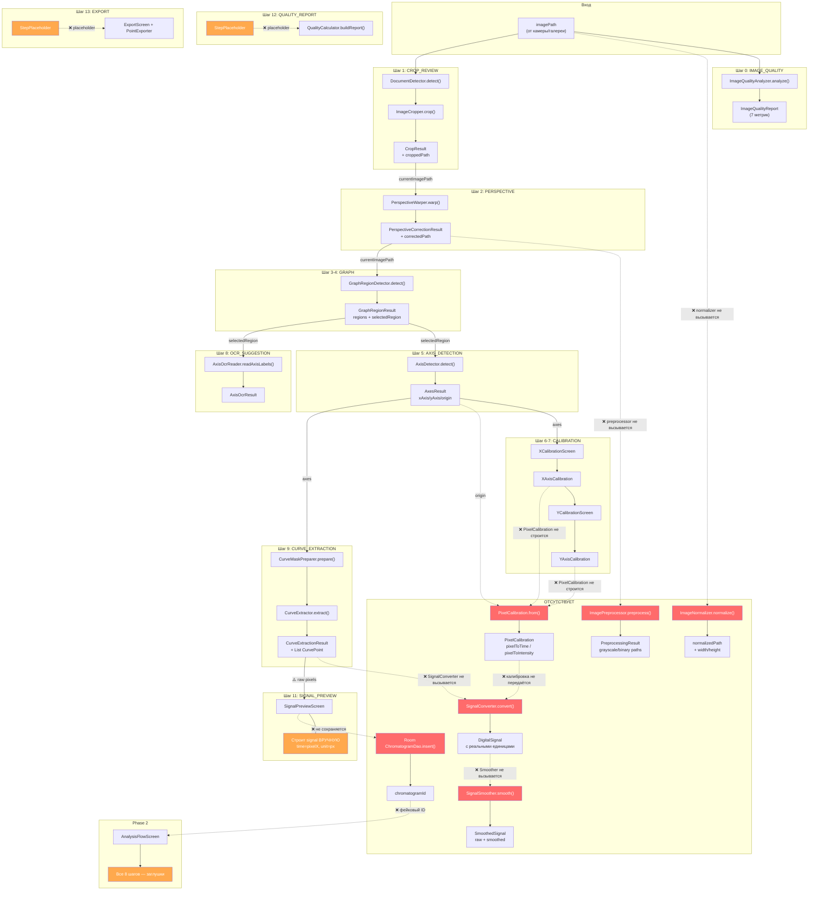

# ChromaLab — Data Flow Audit (Phase 1b.1)

> Формальная фиксация всех разрывов между модулями pipeline.
> Каждый модуль описан: что принимает, что отдаёт, что сломано.

---

## Граф потока данных



---

## Реестр разрывов

### 🔴 Критические (данные теряются / не создаются)

| # | Разрыв | Где | Что происходит | Что должно быть |
|---|--------|-----|---------------|-----------------|
| B1 | **ImageNormalizer** не вызывается | `ProcessingFlowScreen:L118-231` | `imagePath` используется напрямую, EXIF ориентация не исправлена | Вызвать первым, все шаги работают с `normalizedPath` |
| B2 | **ImagePreprocessor** не вызывается | `ProcessingFlowScreen:L118-231` | `CurveMaskPreparer` получает цветное фото вместо бинаризованного | Вызвать после PERSPECTIVE, передать `binaryPath` в mask preparer |
| B3 | **PixelCalibration** не строится | `ProcessingFlowScreen:L111-112` | `xCalibration` и `yCalibration` сохраняются, но не объединяются | `PixelCalibration.from(xCal, yCal, origin.x, origin.y)` |
| B4 | **SignalConverter** не вызывается | `ProcessingFlowScreen:L206-228` | Сигнал строится вручную: `time=pixelX, unit="px"` | `SignalConverter.convert(curvePoints, calibration, path)` |
| B5 | **SignalSmoother** не вызывается | `ProcessingFlowScreen:L224-227` | `smoothed = signal` (одинаковый raw и smoothed) | `SignalSmoother.smooth(signal, params)` |
| B6 | **Room** не используется | нигде | `DigitalSignal` не сохраняется в DB | `ChromatogramDao.insert(entity)` |
| B7 | **Phase 1→2 bridge** фейковый | `App.kt:L140` | `signalId = "signal_${timestamp}"` | Реальный `chromatogramId` из Room |

### 🟡 Средние (placeholder вместо реального экрана)

| # | Разрыв | Что сейчас | Что должно быть |
|---|--------|-----------|-----------------|
| M1 | **QUALITY_REPORT** | `StepPlaceholder` | `QualityCalculator.buildReport()` → `DigitizationQualityReport` → UI |
| M2 | **EXPORT** | `StepPlaceholder` | `ExportScreen(signal, bundle, sessionWriter)` |
| M3 | **AnalysisFlowScreen** | 8 текстовых заглушек | Загрузка из Room + реальные Phase 2 алгоритмы |

### 🟢 Минорные (работает, но с оговорками)

| # | Проблема | Описание |
|---|----------|----------|
| G1 | `fallbackCropResult` не обновляет `currentImagePath` | Строка 146: `cropResult = fallbackCropResult(imagePath)` — но `currentImagePath` не обновляется |
| G2 | `DocumentDetector` вызывается **дважды** | Один раз в CROP (L130), второй в PERSPECTIVE (L153) — лишняя работа |
| G3 | `selectedRegion` инициализирован хардкодом | L109: `GraphRegion(0, 0, 1920, 1080)` — не знает реальный размер |
| G4 | Multi-graph не поддерживается | Выбирается один регион, pipeline проходит один раз |
| G5 | Ошибки молча проглатываются | L234-236: `catch (e) { e.printStackTrace() }` — пользователь видит бесконечный спиннер |
| G6 | Desktop не компилируется | `App.kt`: `arguments?.getString()` — Android API |

---

## Правильный порядок потока данных

```
imagePath
  │
  ├──► ImageNormalizer.normalize()          → normalizedPath, width, height
  │
  ├──► ImageQualityAnalyzer.analyze()       → ImageQualityReport
  │
  ├──► DocumentDetector.detect()            → DocumentBounds (corners)
  │     └── bounds хранятся для crop И perspective
  │
  ├──► ImageCropper.crop()                  → CropResult, croppedPath
  │
  ├──► PerspectiveWarper.warp()             → correctedPath
  │       (используются corners из detect, НЕ вызывать detect повторно)
  │
  ├──► ImagePreprocessor.preprocess()       → grayscale, binary, morphology paths
  │
  ├──► GraphRegionDetector.detect()         → regions[], selectedRegion
  │
  ├──► AxisDetector.detect()                → xAxis, yAxis, origin
  │
  ├──► XCalibrationScreen → xCalibration
  ├──► YCalibrationScreen → yCalibration
  ├──► PixelCalibration.from(xCal, yCal, origin)  ← ОТСУТСТВУЕТ
  │
  ├──► AxisOcrReader.readAxisLabels()       → AxisOcrResult (hint)
  │
  ├──► CurveMaskPreparer.prepare(binaryPath, ...)  ← сейчас получает цветное фото
  ├──► CurveExtractor.extract()             → CurveExtractionResult, curvePoints
  │
  ├──► SignalConverter.convert(curvePoints, calibration)  ← ОТСУТСТВУЕТ
  │       → DigitalSignal (мин/mAU)
  │
  ├──► SignalSmoother.smooth(signal)         ← ОТСУТСТВУЕТ
  │       → SmoothedSignal
  │
  ├──► QualityCalculator.buildReport(...)    ← placeholder
  │
  ├──► ExportScreen(signal, bundle)          ← placeholder
  │
  ├──► ChromatogramDao.insert()              ← ОТСУТСТВУЕТ
  │       → chromatogramId
  │
  └──► Route.Analysis(chromatogramId)        ← фейковый ID
```

---

## Сводка: что реализовано vs что подключено

| Модуль | Реализован | Подключён | Строки кода |
|--------|:----------:|:---------:|:-----------:|
| ImageQualityAnalyzer | ✅ | ✅ | 324 |
| ImageNormalizer | ✅ | ⚠️ только для width/height | ~60 |
| DocumentDetector | ✅ | ✅ (но дважды) | 304 |
| ImageCropper | ✅ | ✅ | 46 |
| PerspectiveWarper | ✅ | ✅ | 171 |
| ImagePreprocessor | ✅ | ❌ **не вызывается** | 242 |
| GraphRegionDetector | ✅ | ✅ | 310 |
| AxisDetector | ✅ | ✅ | 173 |
| AxisOcrReader | ✅ | ✅ | 170 |
| CurveMaskPreparer | ✅ | ✅ (неверный input) | 316 |
| CurveExtractor | ✅ | ✅ | 278 |
| PixelCalibration | ✅ | ❌ **не строится** | 71 |
| SignalConverter | ✅ | ❌ **не вызывается** | 136 |
| SignalSmoother | ✅ | ❌ **не вызывается** | 138 |
| QualityCalculator | ✅ | ❌ **placeholder** | 199 |
| ExportScreen | ✅ | ❌ **placeholder** | 192 |
| PointExporter | ✅ | ❌ **не вызывается** | 62 |
| IntermediateFileSaver | ✅ | ❌ **не вызывается** | 105 |
| SessionWriter | ✅ | ❌ **не вызывается** | 29 |
| FileSharer | ✅ | ❌ **не вызывается** | 14 |
| ChromatogramDao | ✅ | ❌ **не вызывается** | ~50 |
| AnalysisFlowScreen | ✅ (shell) | ❌ **заглушки** | 190 |

**Итого**: 21 модуль реализован, 11 из них **не подключены** (52%).
