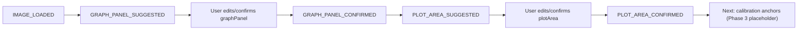

# Phase 2 Guided ROI Editor

Phase: Guided GraphPanel / PlotArea Editor
Status: IMPLEMENTED_FOR_COMPONENT_AND_CONTRACT_LAYER
Date: 2026-05-20

## Goal

Phase 2 adds the first guided production UI surface: a reusable ROI editor for graphPanel and plotArea confirmation. It does not implement calibration anchors, trace editing, peak editing, or chromatographic math changes.

## Scope

Implemented:

- reusable Compose/KMP image ROI editor component;
- zoom and pan over normalized/source image;
- draggable graphPanel and plotArea rectangles;
- resize handles with large touch targets;
- status chips for suggested, confirmed, review, and invalid states;
- pure reducer for bounds updates, validation, reset, and confirmation;
- persistence-ready serializable `GuidedRoiEditorSnapshot`;
- mapping into Phase 1 contracts:
  - `UserConfirmedGraphPanel`;
  - `GraphPanelConfirmation`;
  - `UserConfirmedPlotArea`;
  - `PlotAreaConfirmation`;
  - `RoiConfirmationEvidence`.

Out of scope:

- Phase 3 calibration-point placement;
- manual calibration editor;
- trace editor;
- peak editor;
- VLM/OCR changes;
- full-auto geometry fixes;
- `CalculationEngine` changes;
- release-ready report generation.

## Components

| Component | File | Responsibility |
| --- | --- | --- |
| `GuidedRoiEditorScreen` | `GuidedRoiEditorScreen.kt` | Screen shell for graphPanel/plotArea confirmation. |
| `GuidedRoiEditorContent` | `GuidedRoiEditorScreen.kt` | Stateless content API that can be hoisted by future navigation/state holders. |
| `GuidedRoiImageEditor` | `GuidedRoiEditorScreen.kt` | Image viewer with zoom, pan, ROI overlays, move, and resize handles. |
| `GuidedRoiEditorReducer` | `GuidedRoiEditorModel.kt` | Pure state update, validation, reset, and confirmation logic. |
| `GuidedRoiEditorColors` | `GuidedRoiEditorDesign.kt` | Scientific dark-mode ROI overlay palette. |
| `GuidedRoiEditorStrings` | `GuidedRoiEditorStrings.kt` | RU/EN-ready text surface for the editor. |

## Validation Rules

GraphPanel:

- bounds must exist;
- width and height must be non-zero;
- bounds must stay inside the normalized image.

PlotArea:

- bounds must exist;
- graphPanel must exist;
- width and height must be non-zero;
- plotArea must stay inside graphPanel;
- plotArea equal to full graphPanel is allowed only as review-grade because it may include title/tick labels;
- plotArea near graphPanel edges is review-grade because axes or labels may be cut.

## Confirmation Semantics

When the user confirms graphPanel or plotArea, the reducer records:

- normalized bounds;
- source:
  - `USER_CONFIRMED`;
  - `USER_EDITED_AUTO_SUGGESTION`;
  - `MANUAL`;
- timestamp;
- user/session provenance;
- related image id/path;
- optional overlay artifact path;
- validation warning codes;
- gate status.

Phase 2 confirmations satisfy only the relevant geometry gates. They do not make the full report `RELEASE_READY`; calibration, trace, evidence package, and remaining gates still apply.

## Workflow

## Evidence Gate Behavior

- `GUIDED_PRODUCTION` and `MANUAL_ADVANCED` can use user-confirmed graphPanel/plotArea as gate evidence.
- `AUTO_DIAGNOSTIC` still cannot use user confirmation objects to masquerade as release-ready output.
- Review-grade ROI warnings map to `REVIEW_REQUIRED` and must remain visible in the eventual report provenance.

## Testing

Added reducer/state tests for:

- graphPanel bounds update and image clamping;
- plotArea bounds update and graphPanel clamping;
- plotArea-inside-graphPanel validation;
- zero-area invalidation;
- reset to suggestion;
- confirmation status and source provenance;
- review-grade plotArea when it equals graphPanel;
- `AUTO_DIAGNOSTIC` gate isolation;
- serializable snapshot roundtrip;
- invalid confirmation rejection.
