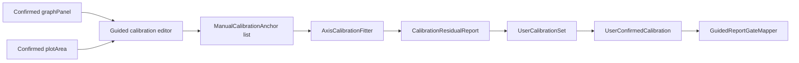

# Phase 3: Guided X/Y Calibration

Phase 3 implements the guided calibration-anchor model and reusable Compose/KMP calibration editor component. It does not implement trace editing, peak editing, report release, VLM behavior, or `CalculationEngine` changes.

## Scope

Implemented:

- user placement of X and Y calibration anchors over the confirmed plotArea;
- anchor add, drag/move, remove, axis reassignment, and numeric value entry;
- minimum-anchor validation for X and Y;
- monotonicity and duplicate-pixel validation;
- deterministic linear fit using the existing `AxisCalibrationFitter`;
- residual, RMSE, R2, accepted/rejected anchor reporting;
- `UserCalibrationSet` and `UserConfirmedCalibration` creation;
- guided report-gate mapping for user-confirmed calibration;
- serialization tests for guided calibration state.

Out of scope:

- calibration-point navigation wiring in the main app flow;
- manual trace editor;
- peak editor;
- chromatographic math changes;
- VLM/OCR changes;
- auto geometry or runtime pipeline rewrites.

## Data Flow

The editor requires a confirmed plotArea before calibration can be confirmed. If plotArea confirmation is missing, reducer confirmation throws and the gate remains missing/diagnostic.

## Validation Rules

`INVALID`:

- plotArea or graphPanel is missing;
- fewer than two X anchors;
- fewer than two Y anchors;
- any anchor value is non-finite;
- duplicate pixel positions contain conflicting numeric values;
- values are non-monotonic;
- the fitter returns invalid for either axis.

`REVIEW`:

- exactly two anchors per axis;
- reversed X direction or positive downward Y direction;
- high residuals or outlier warnings from the fitter;
- otherwise valid calibration with review warnings.

`VALID`:

- three or more anchors per axis;
- finite numeric values;
- monotonic transform;
- residuals pass fitter thresholds;
- graphPanel and plotArea are confirmed.

## Release Gate Behavior

Phase 3 can satisfy only the X/Y calibration gate inputs in `GUIDED_PRODUCTION` or `MANUAL_ADVANCED`.

- `USER_CONFIRMED_VALID` calibration maps to `EvidenceGateStatus.USER_CONFIRMED`.
- two-anchor or warning-bearing calibration maps to `EvidenceGateStatus.REVIEW`.
- invalid or missing calibration maps to `EvidenceGateStatus.INVALID` or `MISSING`.
- `AUTO_DIAGNOSTIC` still ignores user-confirmed objects and cannot become release-ready through manual anchors.

A report still cannot be `RELEASE_READY` after Phase 3 alone because trace and peak review gates are not implemented.

## Evidence

Confirmed calibration stores:

- calibration set id;
- anchor ids, axes, pixel positions, numeric values, unit labels;
- source (`USER_CONFIRMED`, `USER_EDITED_AUTO_SUGGESTION`, `MANUAL`, etc.);
- accepted/rejected/outlier anchor status;
- residual reports per axis;
- timestamp;
- user/session provenance;
- overlay artifact path when available;
- warning codes and gate status.

## Tests

Added `GuidedCalibrationEditorModelTest` for:

- missing plotArea block;
- minimum X/Y anchors;
- non-numeric values;
- two-point slope/intercept;
- three-point residuals;
- high residual review/invalid behavior;
- move/remove/reset;
- `AUTO_DIAGNOSTIC` gate isolation;
- guided calibration gate mapping;
- serialization roundtrip.
