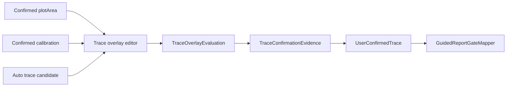

# Phase 4: Guided Trace Overlay Confirmation

Phase 4 implements guided trace overlay confirmation. It lets the user review an extracted trace over the confirmed plotArea and persist a valid, review-grade, or rejected trace decision.

This phase does not implement manual trace drawing, peak editing, peak integration changes, VLM changes, or `CalculationEngine` changes.

## Scope

Implemented:

- `TraceOverlayPoint` contract for overlay polyline evidence;
- `TraceOverlaySource` and `TraceConfirmationStatus` provenance/status enums;
- expanded `TraceQualitySummary` metrics;
- `TraceOverlayEditorSnapshot` and `TraceOverlayEvaluation`;
- reducer logic for reset, accept valid, accept review, and reject;
- reusable Compose/KMP trace overlay screen;
- guided report-gate mapping through existing `UserConfirmedTrace`;
- tests for missing plotArea, missing points, out-of-plot points, sparse/review traces, rejection, reset, AUTO isolation, guided gate mapping, and serialization.

Out of scope:

- manual trace drawing/editing;
- peak editor and peak review;
- auto curve extraction algorithm changes;
- report rendering redesign;
- runtime evidence exporter changes.

## Data Flow

## Trace Quality Inputs

The model accepts or infers:

- `pointCount`;
- `columnCoverageRatio`;
- `maxGapColumns`;
- `componentCount`;
- `branchPointCount`;
- `selectedComponentCoverage`;
- `textContaminationScore`;
- `baselineTouchRatio`;
- `frameTouchRatio`;
- `traceConfidence`;
- trace points.

If available metrics are incomplete, the trace is review-grade. Missing metrics are never fabricated.

## Validation Rules

`INVALID`:

- no confirmed plotArea;
- missing calibration when calibrated trace is required;
- no trace points;
- any trace point outside plotArea;
- severe sparse coverage;
- severe text contamination;
- severe frame/border contact;
- very low confidence;
- explicit user rejection.

`REVIEW`:

- low point count;
- sparse column coverage;
- large gaps;
- multiple components;
- branch-like structure;
- unavailable metrics;
- user accepts as review-grade.

`VALID`:

- confirmed plotArea exists;
- confirmed calibration exists;
- trace points exist and stay inside plotArea;
- quality metrics pass thresholds;
- user confirms valid trace.

## Evidence

`TraceConfirmationEvidence` stores:

- source trace id;
- overlay, mask, and centerline artifact paths when available;
- trace points;
- quality status and metrics;
- warning codes;
- source (`AUTO_EXTRACTED`, `USER_CONFIRMED`, `USER_REVIEW_CONFIRMED`, `USER_REJECTED`);
- plotArea bounds;
- calibration set id;
- rejection reason.

`UserConfirmedTrace` stores the evidence plus timestamp, user/session provenance, edit decision, gate status, and confirmation status.

## Release Gate Behavior

- `USER_CONFIRMED_VALID` trace maps to `EvidenceGateStatus.USER_CONFIRMED`.
- `USER_CONFIRMED_REVIEW` trace maps to `EvidenceGateStatus.REVIEW`.
- rejected/invalid trace maps to `EvidenceGateStatus.INVALID`.
- `AUTO_DIAGNOSTIC` ignores guided trace confirmation objects.

Phase 4 cannot complete peak review. Phase 5 must add peak review/edit evidence before peak-specific claims are treated as user-reviewed.
